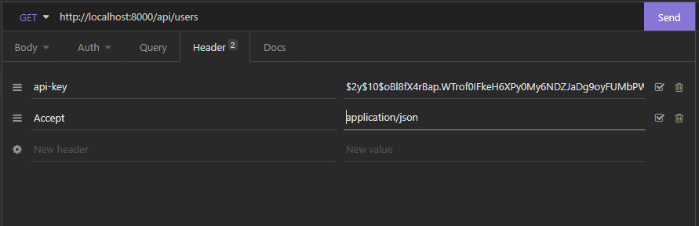
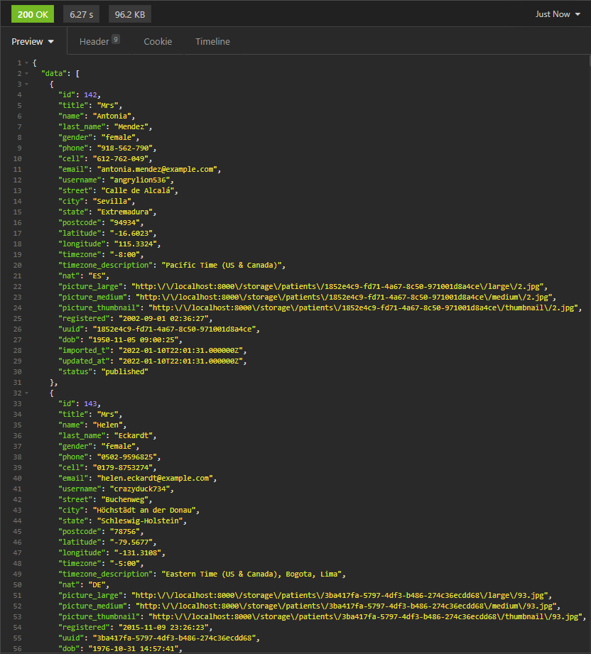
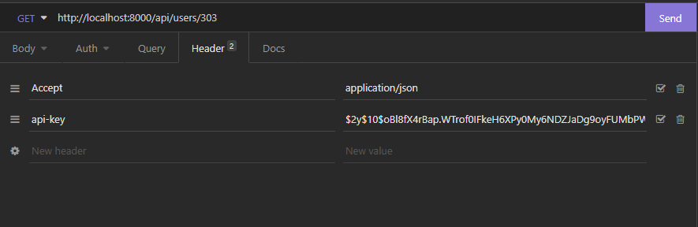
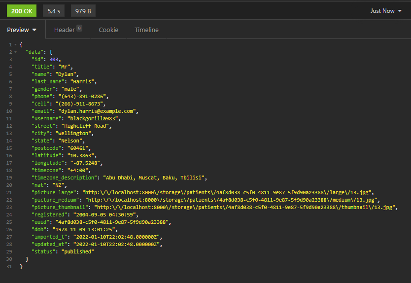
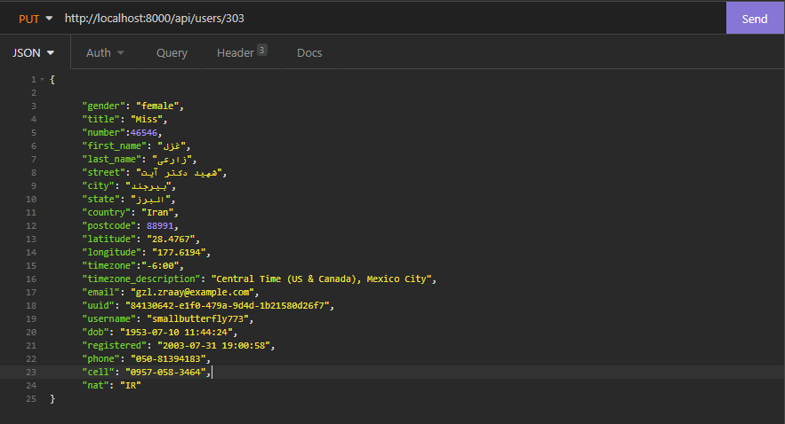
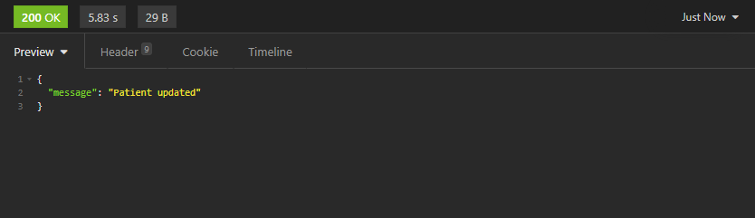
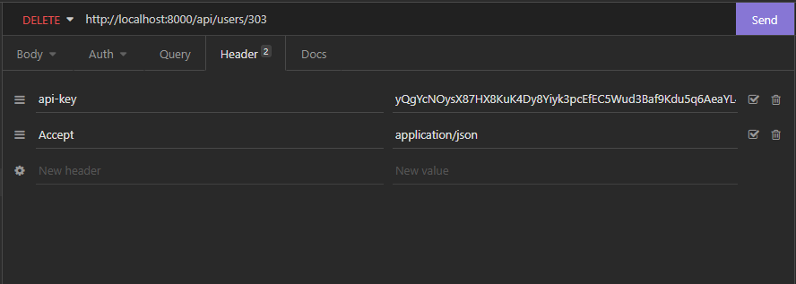
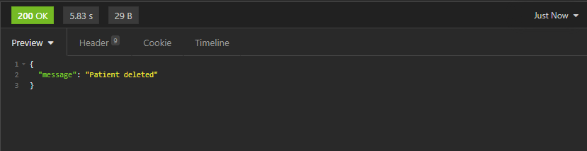
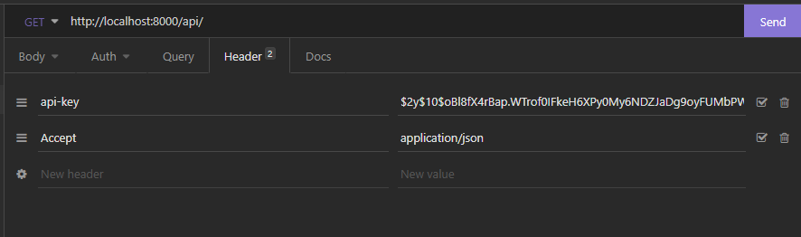
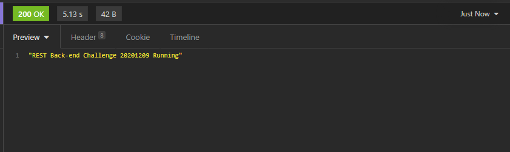

# Pharma Inc Patients API
API projetada com o intuito de criar uma interface de comunicação para que seja possivel consumir os dados dos pacientes da Pharma Inc. Com ela é possivel consultar os pacientes, alterar suas informações e remover os mesmos da base de dados. 

________________________________________________
__________________________________________________
## Pré-requisito.

* Docker;
* Docker-compose.

________________________________________________
__________________________________________________
## Instalação do projeto e configuração do ambiente:
1. Clonar o repositório :

   `
   git@lab.coodesh.com:wasgton/challenge-20201209.git pharmainc/
   `

2. Ingressar no diretório:

   `
   cd pharmainc/
   `

3. Build da imagem docker:

   `
   docker-compose build
   `
4. Subir os containers:

   `
   docker-compose up -d
   `
5. Conectar no container:

   `
    docker-compose exec app
   `

6. Instalando dependências do framework:

   `
   composer install   
   `

7. Criando as tabelas do banco de dados:

   `
   php artisan migrate
   `

8. Configurando a CRON

   `
   cron/cron
   `

________________________________________________
__________________________________________________
## Gerando a API-Key para acesso

### Comando

`
 php artisan api-key:generate
`
###retorno:
`
------------- GENERATING API-KEY ---------------
`

`
API-KEY = $2y$10$NncixhUMi4zr.BLfDovTh.5ihDT7XsRj7l2OqPHe.Xp424/vVv1jC
`

________________________________________________
__________________________________________________

## Importando os pacientes

`
   php artisan remote_data:get
`

________________________________________________
_________________________________________________

##Acessando a API

### Endpoints:

#### GET - /api/

#### GET - /api/users/

#### GET - /api/users/{id}

#### PUT - /api/users/{id}

#### DELETE - /api/users/{id}
_____________________________________
### Header para as requisições
#### Content-Type: application/json
#### Accept: application/json
#### api-key: $2y$10$NncixhUMi4zr.BLfDovTh.5ihDT7XsRj7l2OqPHe.Xp424/vVv1jC

_____________________________________
### Recuperando todos os usuarios

####GET - http://localhost:8000/api/users/

### Consultando um usuário pela ID

####GET - http://localhost:8000/api/users/{id}

### Alterando o registro de um usuário

####PUT - http://localhost:8000/api/users/{id}

#### Parâmetros disponiveis :

~~~~
number : int
street : string
city : string
state : string
country : string
postcode : string
timezone : string
timezone_description : string
title : string
first_name : string
last_name : string
gender : string
phone : string
cell : string
email : string
registered : datetime:Y-m-dH:i:s
uuid : uuid
username : min:5
dob : datetime:Y-m-dH:i:s
status : string(draft,trash,published)
~~~~

_____________________________________
### Deletando um registro de usuário

####DELETE - http://localhost:8000/api/users/{id}

### Mostrando a mensagem "Back-end Challenge 20201209 Running"

